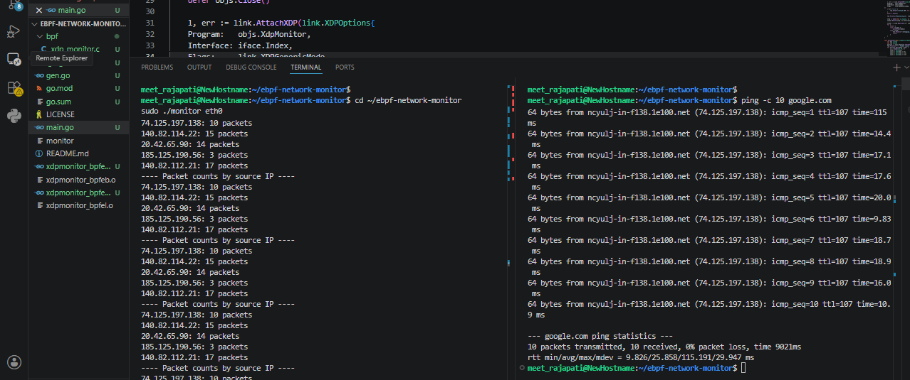

cat > README.md << 'ENDOFREADME'
# eBPF Network Monitor

A kernel-level network traffic monitor built using eBPF and XDP (eXpress Data Path). It attaches directly to a network interface and counts packets per source IP in real time, using an in-kernel hash map — the same underlying technology used by tools like Cilium and modern Linux firewalls.

## Features
- **XDP-based packet capture** — processes packets at the earliest point in the kernel's networking stack, before they reach the normal socket/userspace stack
- **In-kernel packet counting** — tracks packet counts per source IP using an eBPF hash map (BPF_MAP_TYPE_HASH), avoiding the overhead of copying every packet to userspace
- **Go userspace loader** — a lightweight Go program loads the compiled eBPF bytecode, attaches it to a network interface, and periodically reads live stats from the kernel map
- **Generic XDP mode support** — works even on virtualized/software network interfaces (e.g. WSL2, cloud VMs) where native driver-level XDP isn't supported

## Architecture

\`\`\`
Network Interface (e.g. eth0)
      |
      v
[XDP Hook - kernel, before network stack]
      |
      v
[eBPF Program: xdp_monitor.c]
   - Parses Ethernet + IP headers
   - Extracts source IP
   - Increments count in pkt_count map
      |
      v
[eBPF Map: pkt_count] <-- shared between kernel and userspace
      |
      v
[Go Userspace Program: main.go]
   - Attaches the XDP program to the interface
   - Polls pkt_count map every 2 seconds
   - Prints live packet counts by source IP
\`\`\`

## Tech Stack
- C (eBPF program, compiled to bytecode via clang)
- Go + cilium/ebpf library (userspace loader and map interaction)
- Linux XDP/eBPF subsystem
- bpf2go (generates Go bindings from compiled eBPF object code)

## How to Run

### Prerequisites
\`\`\`bash
sudo apt install -y clang llvm libbpf-dev golang-go
\`\`\`
Requires Go 1.19+ and a Linux kernel with eBPF/XDP support (5.x+).

### Build
\`\`\`bash
go generate ./...
go build -o monitor .
\`\`\`

### Run
\`\`\`bash
# find your interface name
ip a

# run the monitor (requires sudo)
sudo ./monitor eth0
\`\`\`

## Demo

Running the monitor while generating traffic (\`ping -c 10 google.com\`) shows live, per-source-IP packet counts refreshed every 2 seconds directly from the kernel-space map:

\`\`\`
Monitoring on eth0 - Ctrl+C to stop
---- Packet counts by source IP ----
74.125.197.138: 3 packets
20.42.65.90: 4 packets
185.125.190.56: 1 packets
\`\`\`

## Notes on WSL2 / Virtualized Environments
WSL2's virtual network interface doesn't support native (driver-level) XDP, since that requires specific NIC driver support. This project uses generic XDP mode (\`link.XDPGenericMode\`) instead, which runs the eBPF program slightly later in the stack (still before the normal socket layer) and works on virtually any interface, including WSL2's eth0 and most cloud VM network interfaces.

## Limitations / Future Work
- Currently read-only monitoring - doesn't drop or block any traffic yet
- No persistence - counts reset when the program stops
- Native XDP mode (higher performance, used in production for line-rate filtering) requires a real NIC driver with XDP support - not available in WSL2 or many virtualized environments
- Planned: extend with a second eBPF map as a blocklist, allowing the program to actually drop packets (XDP_DROP) from specific source IPs, turning this from a monitor into a lightweight in-kernel firewall

## What I Learned
Building this required understanding how XDP hooks into the kernel's networking stack before the normal socket layer, and how eBPF maps let a kernel-space program share state with a userspace Go process without expensive context switches for every packet. It also required a practical lesson in portability - the difference between native and generic XDP modes, and why virtualized environments like WSL2 or cloud VMs often can't use native XDP, mirroring real deployment considerations for any organization running network tooling in the cloud rather than on bare metal.
ENDOFREADME
